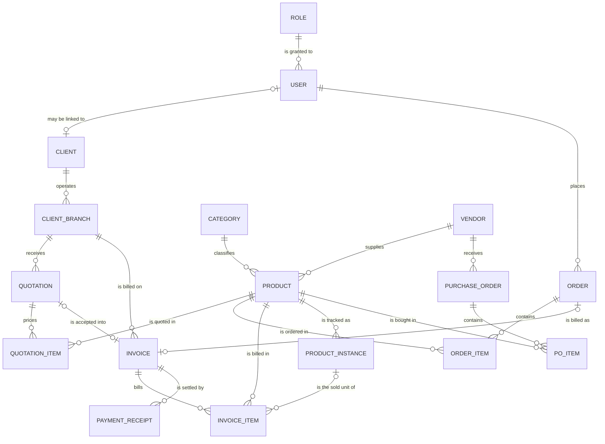
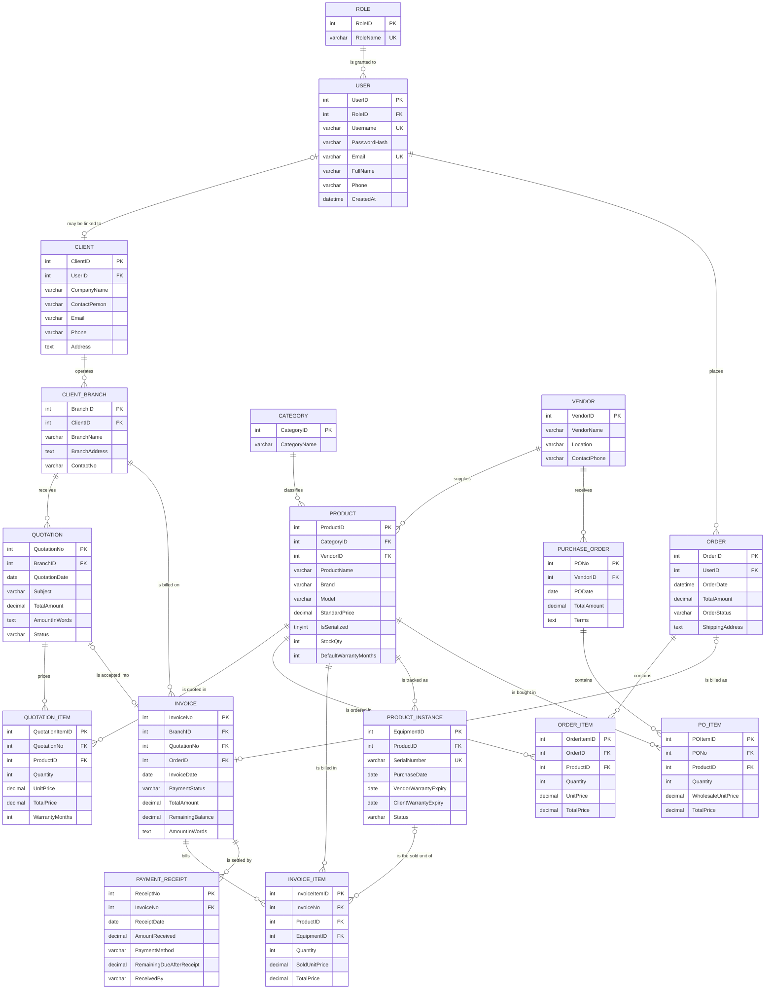

# SebaBD — E-commerce Database & Storefront

SebaBD is a small business-to-business (B2B) and retail e-commerce system for a Bangladeshi
IT products and services company. This repository is primarily a **database management
project**: it designs, normalises and documents a 17-table MySQL schema, and then shows a
complete PHP application reading and writing that schema — catalog, accounts, orders,
quotations, invoices, payments, procurement, stock control and reporting.

Two things are deliberately kept separate:

| Layer | What it is | Where it lives |
| --- | --- | --- |
| **Database design** | The schema, keys, constraints and relationships this project is graded on | [`database/e_commerce_schema.sql`](database/e_commerce_schema.sql), [`database/e_commerce.sql`](database/e_commerce.sql), the **Database design** section below |
| **Application** | Ordinary PHP pages that read/write that schema through PDO | Root `*.php` files, `partials/`, `assets/`, `reports/`, `api/` |

Everything the application shows is stored in, or derived from, the database — there is no
JavaScript framework, no separate API service and no ORM. A page request loads `db.php`,
`helpers.php` and (for storefront pages) `catalog-data.php`, then renders HTML from SQL
results.

### Quick facts

| Item | Value |
| --- | --- |
| Database | `e_commerce` (MySQL / MariaDB, InnoDB, `utf8mb4`) |
| Tables | 17 (catalog, customers, stock, orders, quotations, billing, procurement) |
| Foreign keys | 22, declared with explicit `ON DELETE` behaviour |
| Primary keys | Explicit integer keys (`OrderID`, `ProductID`, …) — no `AUTO_INCREMENT` |
| Server language | PHP 8.1+ (verified on 8.2.12) |
| Database access | PDO with `pdo_mysql`, native prepared statements |
| Currency | Bangladeshi taka (`৳`), configured once in `config.php` |
| Reports | KoolReport 6.7.1 (vendored under `vendor/koolreport/core`) |
| Frontend | Server-rendered PHP + Bootstrap 5 + one CSS file + vanilla JavaScript |

---

## Getting started

### Requirements

- Windows with XAMPP (verified with XAMPP 8.2.12 and MariaDB 10.4.32), or any PHP 8.1+ / MySQL
  environment.
- PHP extensions: `pdo_mysql` (required), `mbstring` (used by form validation).
- Internet access for the Bootstrap, Font Awesome and Google Charts CDNs used by the pages.

### 1. Start the database

Open the XAMPP Control Panel and start **MySQL**. Start **Apache** too if you want to browse
the site through `localhost`.

### 2. Import the schema and sample data

From the project root:

```powershell
C:\xampp\mysql\bin\mysql.exe -u root < database\e_commerce.sql
```

The dump creates the `e_commerce` database, all 17 tables, their keys/constraints **and** a
small set of realistic sample rows. If you prefer a clean database instead, import
`database/e_commerce_schema.sql` instead — import one or the other, never both.

If the database was created before the separate B2B role existed, run the migration once:

```powershell
C:\xampp\mysql\bin\mysql.exe -u root < database\migrate-b2b-client-role.sql
```

### 3. Check the connection settings

`config.php` holds the database and currency settings:

```php
'db' => [
    'host' => '127.0.0.1',
    'port' => 3306,
    'name' => 'e_commerce',
    'user' => 'root',
    'password' => '',
    'charset' => 'utf8mb4',
],
```

Never commit a real production password here.

### 4. Open the site

With Apache running:

```text
http://localhost/Ecommerce%20Website/
```

Or use the PHP development server from the project root:

```powershell
C:\xampp\php\php.exe -S 127.0.0.1:8787
```

### Sample logins

The dump creates four working accounts — no separate password import is needed:

| Username | Password | Role | What it demonstrates |
| --- | --- | --- | --- |
| `admin` | `admin123` | Admin | Staff dashboard (revenue, receivables, stock alerts) and every report |
| `sales` | `sales123` | Sales Manager | Sales, invoice and quotation reports |
| `inventory` | `stock123` | Inventory Manager | Procurement and stock reports |
| `client` | `client123` | B2B Client Account | Company dashboard: Meghna Infotech's branches, quotations, invoices and receipts |

Accounts created through `register.php` become `Client Account` (role 4); accounts created
through `b2b-registration.php` become `B2B Client Account` (role 5). Staff roles can only be
assigned by an administrator — public registration never grants them.

---

## Database design

This is the part the project exists for. The schema is stored once, in
[`database/e_commerce_schema.sql`](database/e_commerce_schema.sql) (structure only) and
[`database/e_commerce.sql`](database/e_commerce.sql) (structure + sample rows). Every
diagram, table and rule below describes exactly those files.

### Design principles

| Decision | Why it was made |
| --- | --- |
| Lowercase **singular** table names (`product`, not `Products`) | Each row is one instance of the entity; the name reads naturally in SQL joins (`product.ProductID`). |
| Explicit integer primary keys (no `AUTO_INCREMENT`) | The lab requires visible, meaningful keys, and documents how an application can allocate the next id itself (`next_id()` in `helpers.php` reads `MAX(column) + 1` inside a transaction). |
| `PascalCase` column names, `TableNameID` for keys | Every foreign key column has exactly the same name as the primary key it points at, so joins are unambiguous. |
| InnoDB + `utf8mb4` | InnoDB gives real foreign-key enforcement and transactions; `utf8mb4` stores every character the Bangladeshi and English catalogs need. |
| Company selling is modelled through **branches** | A quotation or invoice is always addressed to a specific office, but the company is the customer. `client_branch` therefore sits between `client` and the sales documents. |
| Retail orders hang off the **user**, not the company | A quick order is placed by the signed-in account; corporate identity flows through `client` → `client_branch` for quotations and invoices only. |
| Money is copied into line items | `UnitPrice`, `SoldUnitPrice` and `WholesaleUnitPrice` snapshot the price at document time, so a later catalog change cannot rewrite history (see *Deliberate denormalisation*). |
| Every foreign key declares its delete behaviour | `ON DELETE CASCADE` for dependent line rows, `SET NULL` for optional links, `RESTRICT` (the default) everywhere else. |
| The reserved word `order` is always quoted | MySQL treats `order` as a keyword, so the table is written as `` `order` `` in every statement. |

### Entity–relationship diagram (conceptual)

Entities and relationship cardinalities only — attributes appear in the schema diagram
below. Crow's-foot notation: `||` exactly one, `|o` zero or one, `o{` zero or many.



The diagram is grouped around four business processes:

1. **Selling to a person** — `user` → `order` → `order_item` → `product`.
2. **Selling to a company** — `client` → `client_branch` → `quotation` → `quotation_item` → `product`.
3. **Getting paid** — `quotation`/`order` → `invoice` → `invoice_item` → `payment_receipt`.
4. **Refilling stock** — `vendor` → `purchase_order` → `po_item` → `product`, with
   `product_instance` tracking serialized units.

### Schema diagram (logical/physical)

Same 22 foreign keys, now with columns. `PK` primary key, `FK` foreign key, `UK` unique key.
Physical table names are lowercase singular (`order`, `order_item`, …).



#### Dependency map (plain text)

If you are reading this in a terminal without a Mermaid renderer, the same structure is:

```text
role ──── user ─┬─── order ──── order_item ───────── product ─┬─── category
                │                                             ├─── vendor
                │                                             └─── product_instance ─┐
                └─── client ──── client_branch ─┬─── quotation ──── quotation_item ──┤
                                                │                                   │
                                                └─── invoice ──── invoice_item ──────┘
                                                          │
                                                          └─── payment_receipt

vendor ─┬─── product
        └─── purchase_order ──── po_item ──── product
```

### Data dictionary

Types are the physical MySQL types from the schema dump. Keys: **PK** primary key,
**FK** foreign key, **UK** unique key.

#### Identity & access

**`role`** — the permission levels a login can hold. Referenced by `user`.

| Column | Type | Key | Notes |
| --- | --- | --- | --- |
| `RoleID` | `int` | PK | 1 Admin, 2 Sales Manager, 3 Inventory Manager, 4 Client Account, 5 B2B Client Account |
| `RoleName` | `varchar(50)` | UK | Displayed in the header and used by `is_staff_user()` |

**`user`** — one login account. Staff accounts and customer accounts share this table; the
role decides what the account may open.

| Column | Type | Key | Notes |
| --- | --- | --- | --- |
| `UserID` | `int` | PK | |
| `RoleID` | `int` | FK → `role` | `RESTRICT`: a role in use cannot be deleted |
| `Username` | `varchar(100)` | UK | Unique; also the login identifier |
| `PasswordHash` | `varchar(255)` | | `password_hash()` bcrypt output — never plain text |
| `Email` | `varchar(255)` | UK | Also accepted as a login identifier |
| `FullName` | `varchar(255)` | | Shown in the header, dashboard and orders |
| `Phone` | `varchar(50)` | | Optional |
| `CreatedAt` | `datetime` | | Defaults to `CURRENT_TIMESTAMP` |

#### Customers

**`client`** — a company (or the shared walk-in customer). A client may own a login, which is
why `UserID` is *nullable but unique*.

| Column | Type | Key | Notes |
| --- | --- | --- | --- |
| `ClientID` | `int` | PK | |
| `UserID` | `int` | FK → `user`, UK | `ON DELETE SET NULL`: removing a login keeps the company |
| `CompanyName` | `varchar(255)` | | |
| `ContactPerson` | `varchar(255)` | | |
| `Email`, `Phone` | `varchar(255)`, `varchar(50)` | | Company-level contact details |
| `Address` | `text` | | Registered/head-office address |

**`client_branch`** — an office or delivery location of a client. Quotations and invoices are
always addressed to a branch, never to a bare company. `ClientID` is `NOT NULL`, so a branch
cannot exist without its company.

| Column | Type | Key | Notes |
| --- | --- | --- | --- |
| `BranchID` | `int` | PK | |
| `ClientID` | `int` | FK → `client` | `ON DELETE CASCADE`: branches die with the company |
| `BranchName` | `varchar(255)` | | e.g. `Meghna Infotech - Head Office` |
| `BranchAddress` | `text` | | Used as the delivery/billing address |
| `ContactNo` | `varchar(50)` | | Optional |

#### Catalog

**`category`** — top-level grouping used by the storefront sidebar (Laptops & Computers,
Monitors & Displays, …).

| Column | Type | Key | Notes |
| --- | --- | --- | --- |
| `CategoryID` | `int` | PK | |
| `CategoryName` | `varchar(255)` | | |

**`vendor`** — a supplier SebaBD buys from. Vendors appear on purchase orders and as the
source recorded against serialized units.

| Column | Type | Key | Notes |
| --- | --- | --- | --- |
| `VendorID` | `int` | PK | |
| `VendorName` | `varchar(255)` | | |
| `Location` | `varchar(255)` | | |
| `ContactPhone` | `varchar(50)` | | |

**`product`** — the sellable item. It carries both the list price and the stock rule
(`IsSerialized`).

| Column | Type | Key | Notes |
| --- | --- | --- | --- |
| `ProductID` | `int` | PK | |
| `CategoryID` | `int` | FK → `category` | `RESTRICT` |
| `VendorID` | `int` | FK → `vendor` | `RESTRICT` |
| `ProductName` | `varchar(255)` | | |
| `Brand`, `Model` | `varchar(100)` | | Searchable in the storefront |
| `StandardPrice` | `decimal(12,2)` | | The price copied into every line item |
| `IsSerialized` | `tinyint(1)` | | `1` = stock is tracked unit-by-unit in `product_instance` |
| `StockQty` | `int` | | Only meaningful when `IsSerialized = 0` |
| `DefaultWarrantyMonths` | `int` | | Copied into `quotation_item.WarrantyMonths` as the default |

#### Stock control

**`product_instance`** — one physical unit of a serialized product (laptop, managed switch).
Availability is *not* stored here as a flag on the product: it is `COUNT(*)` of rows whose
`Status = 'In Stock'`.

| Column | Type | Key | Notes |
| --- | --- | --- | --- |
| `EquipmentID` | `int` | PK | |
| `ProductID` | `int` | FK → `product` | `RESTRICT` |
| `SerialNumber` | `varchar(100)` | UK | One serial number can belong to exactly one unit |
| `PurchaseDate` | `date` | | When SebaBD bought the unit |
| `VendorWarrantyExpiry` | `date` | | Warranty against the supplier |
| `ClientWarrantyExpiry` | `date` | | Warranty promised to the customer |
| `Status` | `varchar(50)` | | Defaults to `In Stock`; also `Sold`, `RMA`, … |

#### Retail orders

**`order`** — the header of a quick order placed by a signed-in user. (MySQL reserves the
word `order`, so every query uses `` `order` ``.)

| Column | Type | Key | Notes |
| --- | --- | --- | --- |
| `OrderID` | `int` | PK | |
| `UserID` | `int` | FK → `user` | `RESTRICT`; the customer is the account, not a company |
| `OrderDate` | `datetime` | | Defaults to `CURRENT_TIMESTAMP` |
| `TotalAmount` | `decimal(12,2)` | | Header total; equals the sum of its `order_item` rows |
| `OrderStatus` | `varchar(50)` | | Defaults to `Pending`; also `Processing`, `Completed`, `Cancelled` |
| `ShippingAddress` | `text` | | Typed by the customer at checkout |

**`order_item`** — one product line of an order. The classic *weak entity* of the order:
it only exists as part of a header, so `OrderID` cascades.

| Column | Type | Key | Notes |
| --- | --- | --- | --- |
| `OrderItemID` | `int` | PK | |
| `OrderID` | `int` | FK → `order` | `ON DELETE CASCADE` |
| `ProductID` | `int` | FK → `product` | `RESTRICT` |
| `Quantity` | `int` | | Checked to be 1–999 by the application |
| `UnitPrice` | `decimal(12,2)` | | **Snapshot** of `product.StandardPrice` at order time |
| `TotalPrice` | `decimal(12,2)` | | `Quantity × UnitPrice`, also stored for reporting |

#### B2B quotations

**`quotation`** — a priced offer issued to a company branch.

| Column | Type | Key | Notes |
| --- | --- | --- | --- |
| `QuotationNo` | `int` | PK | Document number, e.g. `1001` |
| `BranchID` | `int` | FK → `client_branch` | `RESTRICT`; corporate identity lives here |
| `QuotationDate` | `date` | | |
| `Subject` | `varchar(255)` | | e.g. `10 office workstations` |
| `TotalAmount` | `decimal(12,2)` | | Header total; equals the sum of its items |
| `AmountInWords` | `text` | | Printed wording, produced by `amount_in_words()` |
| `Status` | `varchar(50)` | | Defaults to `Pending`; also `Accepted`, `Rejected` |

**`quotation_item`** — quotation lines. Unlike an order line it also carries the **warranty**
agreed per line, because warranties are negotiated per item in B2B sales.

| Column | Type | Key | Notes |
| --- | --- | --- | --- |
| `QuotationItemID` | `int` | PK | |
| `QuotationNo` | `int` | FK → `quotation` | `ON DELETE CASCADE` |
| `ProductID` | `int` | FK → `product` | `RESTRICT` |
| `Quantity`, `UnitPrice`, `TotalPrice` | `int`, `decimal(12,2)`, `decimal(12,2)` | | Priced line, `UnitPrice` snapshotted |
| `WarrantyMonths` | `int` | | Defaults from the product, overridable per line |

#### Billing & payments

**`invoice`** — what a customer owes. One invoice can come from an order, from an accepted
quotation, or from neither (a manually raised invoice), which is why both links are nullable
— and both are `UNIQUE`, so one order/quotation can never be invoiced twice.

| Column | Type | Key | Notes |
| --- | --- | --- | --- |
| `InvoiceNo` | `int` | PK | |
| `BranchID` | `int` | FK → `client_branch` | Who is billed |
| `QuotationNo` | `int` | FK → `quotation`, UK | `NULL` for retail invoices |
| `OrderID` | `int` | FK → `order`, UK | `NULL` for quotation invoices |
| `InvoiceDate` | `date` | | |
| `PaymentStatus` | `varchar(50)` | | Defaults to `DUE`; also `PARTIAL`, `PAID` |
| `TotalAmount` | `decimal(12,2)` | | Amount billed |
| `RemainingBalance` | `decimal(12,2)` | | Amount still owed; `0.00` once paid |
| `AmountInWords` | `text` | | Printed wording |

**`invoice_item`** — a billed line. It is the only table that can point at a specific
physical unit (`EquipmentID`), which is how SebaBD can later prove *which* laptop a customer
received.

| Column | Type | Key | Notes |
| --- | --- | --- | --- |
| `InvoiceItemID` | `int` | PK | |
| `InvoiceNo` | `int` | FK → `invoice` | `ON DELETE CASCADE` |
| `ProductID` | `int` | FK → `product` | `RESTRICT` |
| `EquipmentID` | `int` | FK → `product_instance` | `ON DELETE SET NULL`; `NULL` for non-serialized lines |
| `Quantity`, `SoldUnitPrice`, `TotalPrice` | `int`, `decimal(12,2)`, `decimal(12,2)` | | `SoldUnitPrice` is the agreed (possibly discounted) price |

**`payment_receipt`** — money actually received. Receipts are append-only history: each row
records the balance *at that moment*, while `invoice.RemainingBalance` always holds the
current position.

| Column | Type | Key | Notes |
| --- | --- | --- | --- |
| `ReceiptNo` | `int` | PK | |
| `InvoiceNo` | `int` | FK → `invoice` | `RESTRICT`; a receipt cannot exist without its invoice |
| `ReceiptDate` | `date` | | |
| `AmountReceived` | `decimal(12,2)` | | |
| `PaymentMethod` | `varchar(50)` | | `Bank Transfer`, `Credit Card`, `Check`, … |
| `RemainingDueAfterReceipt` | `decimal(12,2)` | | Snapshot of the balance after this receipt |
| `ReceivedBy` | `varchar(255)` | | Staff member who took the payment |

#### Procurement

**`purchase_order`** — stock SebaBD buys from a vendor.

| Column | Type | Key | Notes |
| --- | --- | --- | --- |
| `PONo` | `int` | PK | |
| `VendorID` | `int` | FK → `vendor` | `RESTRICT` |
| `PODate` | `date` | | |
| `TotalAmount` | `decimal(12,2)` | | Header total |
| `Terms` | `text` | | Payment/delivery terms |

**`po_item`** — purchase lines. Prices here are **wholesale**, which is why the column is
named `WholesaleUnitPrice` and not just `UnitPrice`.

| Column | Type | Key | Notes |
| --- | --- | --- | --- |
| `POItemID` | `int` | PK | |
| `PONo` | `int` | FK → `purchase_order` | `ON DELETE CASCADE` |
| `ProductID` | `int` | FK → `product` | `RESTRICT` |
| `Quantity` | `int` | | |
| `WholesaleUnitPrice` | `decimal(12,2)` | | Vendor cost per unit at purchase time |
| `TotalPrice` | `decimal(12,2)` | | `Quantity × WholesaleUnitPrice` |

### Relationship & cardinality overview

All 22 foreign keys, what they mean and why they exist. *Cardinality* is written from the
parent (one) side to the child side; *optional?* asks whether the child may leave the column
`NULL`.

| # | Parent → Child | FK column | Cardinality | Optional? | `ON DELETE` | Why this relationship is implemented |
| --- | --- | --- | --- | --- | --- | --- |
| 1 | `role` → `user` | `RoleID` | 1 : N | No | `RESTRICT` | Every account must have exactly one permission level. Keeping the role in its own table avoids repeating the same three staff role names on every user row. |
| 2 | `user` → `client` | `UserID` | 1 : 0..1 | Yes (both sides) | `SET NULL` | A company may buy without an online login (walk-in/phone customers), and a login is not automatically a company. Removing the login must not erase the company's sales history. |
| 3 | `client` → `client_branch` | `ClientID` | 1 : N | No | `CASCADE` | Branches are existence-dependent on their company. `ClientID NOT NULL` means a branch cannot exist without a company. |
| 4 | `client_branch` → `quotation` | `BranchID` | 1 : N | No | `RESTRICT` | Corporate documents are addressed to a specific office; the branch cannot be deleted while quotations point at it. |
| 5 | `client_branch` → `invoice` | `BranchID` | 1 : N | Yes (schema) | `RESTRICT` | An invoice is raised against a billing address. The column is nullable for manually raised invoices, but the application always writes it. |
| 6 | `quotation` → `quotation_item` | `QuotationNo` | 1 : N | No | `CASCADE` | Quotation lines have no meaning without their header — the classic weak-entity pattern. |
| 7 | `product` → `quotation_item` | `ProductID` | 1 : N | No | `RESTRICT` | A quotation must always name a real catalog product. Deleting a product that was quoted is blocked so history stays readable. |
| 8 | `user` → `order` | `UserID` | 1 : N | No | `RESTRICT` | A retail order belongs to the account that placed it. Keeping this link is what lets the dashboard list *my* orders. |
| 9 | `order` → `order_item` | `OrderID` | 1 : N | No | `CASCADE` | Order lines exist only inside their order. |
| 10 | `product` → `order_item` | `ProductID` | 1 : N | No | `RESTRICT` | Same rule as quotations: the catalog row may not disappear underneath an order. |
| 11 | `quotation` → `invoice` | `QuotationNo` | 1 : 0..1 | Yes, `UNIQUE` | `RESTRICT` | An accepted quotation is converted into **at most one** invoice. The `UNIQUE` key enforces that at the database level, not in PHP. |
| 12 | `order` → `invoice` | `OrderID` | 1 : 0..1 | Yes, `UNIQUE` | `RESTRICT` | A retail order can be billed once — also enforced by a `UNIQUE` key. The same invoice cannot come from two orders. |
| 13 | `invoice` → `invoice_item` | `InvoiceNo` | 1 : N | No | `CASCADE` | Billing lines die with their invoice. |
| 14 | `product` → `invoice_item` | `ProductID` | 1 : N | No | `RESTRICT` | Every billed line names what was sold (which is also what the sales report groups by). |
| 15 | `product_instance` → `invoice_item` | `EquipmentID` | 1 : 0..N | Yes | `SET NULL` | For serialized goods, the billed line can name the **exact unit** shipped, so warranty claims follow the physical device. If the unit row is retired, the line survives with a `NULL`. |
| 16 | `invoice` → `payment_receipt` | `InvoiceNo` | 1 : N | No | `RESTRICT` | Receipts are append-only financial records; an invoice with receipts is protected from deletion. |
| 17 | `category` → `product` | `CategoryID` | 1 : N | No | `RESTRICT` | The storefront sidebar is built from categories, and each product belongs to exactly one. |
| 18 | `vendor` → `product` | `VendorID` | 1 : N | No | `RESTRICT` | The supplier of a product is recorded once, in `vendor`, and reused by procurement and stock reports. |
| 19 | `product` → `product_instance` | `ProductID` | 1 : N | No | `RESTRICT` | Only serialized products have instances; each unit knows which catalog item it is. |
| 20 | `vendor` → `purchase_order` | `VendorID` | 1 : N | No | `RESTRICT` | Purchases are always placed with a known supplier. |
| 21 | `purchase_order` → `po_item` | `PONo` | 1 : N | No | `CASCADE` | Purchase lines exist only inside their purchase order. |
| 22 | `product` → `po_item` | `ProductID` | 1 : N | No | `RESTRICT` | What was bought must still be identifiable in the catalog. |

#### Integrity constraints at a glance

| Constraint type | Where it is used | What it guarantees |
| --- | --- | --- |
| Primary key | Every table (17) | Each row is uniquely identifiable; also creates the clustered index InnoDB needs. |
| Unique key | `role.RoleName`, `user.Username`, `user.Email`, `client.UserID`, `product_instance.SerialNumber`, `invoice.QuotationNo`, `invoice.OrderID` | Business rules that must hold regardless of what the application does: one account per username/email, one login per company, one serial number per unit, one invoice per order/quotation. |
| Foreign key | 22 columns (see table above) | Referential integrity: child rows can only point at rows that exist. |
| `NOT NULL` | All keys; most business columns | Required data cannot be skipped by a buggy form. |
| `DEFAULT` | `order.OrderStatus`/`quotation.Status` = `Pending`, `invoice.PaymentStatus` = `DUE`, `product_instance.Status` = `In Stock`, `product.IsSerialized` = `0`, `product.StockQty` = `0`, `CreatedAt`/`OrderDate` = `CURRENT_TIMESTAMP` | New rows start in a sensible, reportable state even if the writer says nothing about that column. |
| Index | Every foreign key column, plus the unique keys | Joins (`product` ↔ `order_item`, `invoice` ↔ `payment_receipt`) stay fast as data grows. |

### Normalisation

The schema is in **third normal form** for its transactional data, with a small number of
*intentional* snapshots described afterwards.

**First normal form — atomic values, no repeating groups.**
A quotation with four products is not one row with `Product1…Product4` columns; it is one
`quotation` row plus four `quotation_item` rows. The same applies to orders, invoices and
purchase orders. Every column holds a single value (`Address` being a `text` block is still a
single logical value).

**Second normal form — no partial dependency on part of a key.**
Every table has a single-column primary key, so no non-key column can depend on only part of a
key. Where a *natural* key exists it is protected separately (`user.Username`, `user.Email`,
`product_instance.SerialNumber` are `UNIQUE`), which keeps the surrogate numeric key from
weakening the model.

**Third normal form — no transitive dependencies.**
Nothing is stored twice inside the same table and nothing depends on a non-key column:

- `product` stores `CategoryID` and `VendorID`, never `CategoryName` or `VendorName`.
- `quotation` stores `BranchID`; the company name is reached through
  `branch → client`, so renaming a company updates one row.
- `client_branch` stores its `ClientID`, not the company name.
- `invoice_item` references `ProductID` and optionally `EquipmentID`; it does not repeat the
  product name or serial number.

#### Deliberate denormalisation (document snapshots)

| Stored value | Would be derivable from | Why it is stored anyway |
| --- | --- | --- |
| `order_item.UnitPrice` | `product.StandardPrice` | The catalog price changes; the customer must be charged the price that was live when the order was placed. |
| `quotation_item.UnitPrice` | `product.StandardPrice` | Same reason, plus negotiated B2B pricing. |
| `invoice_item.SoldUnitPrice` | the quotation/order line | The invoice is the legal document; it must stand on its own even if lines change later. |
| `po_item.WholesaleUnitPrice` | `product.StandardPrice` | Purchase cost is not the selling price at all — it is a different attribute. |
| `order.TotalAmount`, `quotation.TotalAmount`, `invoice.TotalAmount`, `*_item.TotalPrice` | `SUM(quantity × unit price)` | Headers are printed/filed as documents and reports filter on totals; storing them avoids recomputing (and re-deciding rounding) on every read. |
| `quotation.AmountInWords`, `invoice.AmountInWords` | `amount_in_words()` over the total | The wording on the printed document is part of the document. |
| `payment_receipt.RemainingDueAfterReceipt` | `invoice.TotalAmount − SUM(receipts)` | Receipts are append-only history: each one records the balance *at that moment*, so an audit can replay the sequence. `invoice.RemainingBalance` is the current position. |

This is *controlled* redundancy: each column has one writer, one meaning, and a stated
business reason. `product.StockQty` is the one value that is meaningfully split by design —
serialized products ignore it completely and count `product_instance` rows instead, which the
application expresses through `IsSerialized`.

### Sample data

`database/e_commerce.sql` ships a small, complete sample set — four rows in every main table
plus the line items that belong to them — so the diagrams above can be tested immediately. The
sample data is internally consistent:

- each `order` total equals the sum of its `order_item` rows;
- each `quotation` total equals the sum of its `quotation_item` rows;
- each `invoice` total equals the sum of its `invoice_item` rows;
- each `purchase_order` total equals the sum of its `po_item` rows;
- each `invoice.RemainingBalance` equals `TotalAmount − SUM(payment_receipt.AmountReceived)`;
- prices are realistic taka figures (a business laptop is ৳ 144,000, a 4K monitor ৳ 66,000, a
  managed switch ৳ 102,000, a wireless mouse ৳ 12,000) and the amounts in words match the
  currency (`'Four Hundred Twenty Thousand Taka'`);
- companies, contact people and suppliers are plausible businesses (`Meghna Infotech Ltd`,
  `Karnaphuli Logistics Ltd`, `Nexus Digital Distribution Pte Ltd`) instead of placeholders;
- addresses, phone numbers and payment methods are Bangladeshi (`Dhaka`, `Chattogram`,
  `+880 …`, bank transfer, card, bKash, cheque);
- `client_branch` 1 and 2 belong to Meghna Infotech Ltd, whose login is `client` — which is
  why that account's dashboard shows quotations `1001`/`1002` and invoices `5001`/`5003`.

To rebuild a disposable local database, drop `e_commerce` and import the dump again:

```sql
DROP DATABASE e_commerce;
```

```powershell
C:\xampp\mysql\bin\mysql.exe -u root < database\e_commerce.sql
```

Never drop a production database.

---

## How the application is put together

Five layers, no framework:

```text
Browser
  │  requests a page, submits a form, or runs JavaScript
  ▼
PHP page (root *.php)
  │  validates input, reads/writes the database, builds HTML
  ▼
Shared code — helpers.php, db.php, catalog-data.php
  │  sessions/auth, PDO access, catalog presentation, form helpers
  ▼
MySQL database e_commerce
  │  17 tables, 22 foreign keys, InnoDB, utf8mb4
  ▼
HTML + style.css + assets/*.js
```

A normal page request: the browser asks for `index.php` → PHP loads `db.php` (PDO),
`catalog-data.php` and `helpers.php` → SQL runs → PHP renders `partials/header.php`, the page
content and `partials/footer.php`. A form submission follows the same path, except PHP
validates first, writes inside a transaction, then redirects (or answers JSON to the AJAX
layer). With MySQL stopped, catalog pages fall back to a built-in offline catalogue and write
pages refuse gracefully.

### Technology stack

| Area | Technology | Purpose |
| --- | --- | --- |
| Server | PHP 8.1+ | Rendering, validation, sessions, database writes |
| Database | MySQL / MariaDB | The 17-table schema this project is built around |
| Database API | PDO (`pdo_mysql`), native prepares | Parameterised SQL, transactions, one shared connection |
| Styling | `style.css` + Bootstrap 5.3 (CDN) | Layout, components, responsive grid |
| Icons | Font Awesome (CDN) | Navigation and product/category icons |
| Browser behaviour | Vanilla JavaScript (`assets/ajax.js`, `assets/form-items.js`) | AJAX forms, live search, filtering, stock checks, line items |
| Reporting | KoolReport 6.7.1 (vendored) | Tables, charts and KPIs generated from SQL |

### Project structure

#### Pages

| File | Responsibility |
| --- | --- |
| `index.php` | Storefront: hero, category sidebar, product grid, search/filter, deals, features |
| `product.php` | Product detail page — specifications from `product`/`category`/`vendor`, live stock, serialized units for staff, related products |
| `dashboard.php` | Role-aware dashboard: staff see database statistics, stock alerts and receivables; customers see their own orders, quotations and invoices |
| `login.php` | Username/email sign-in; lands on the dashboard |
| `logout.php` | Ends the session |
| `register.php` | Public registration (`Client Account`, role 4) |
| `b2b-registration.php` | Company + first branch + optional login (`B2B Client Account`, role 5) |
| `order.php` | Quick order form; accepts `?product=<id>&qty=<n>` to pre-fill a line |
| `quotation-request.php` | Quotation request form; same pre-fill support |
| `reports.php` | Staff report hub with role-locked cards |
| `report-sales.php`, `report-invoices.php`, `report-quotations.php`, `report-procurement.php`, `report-stock.php` | Report entry pages |
| `privacy.php`, `terms.php` | Policy pages describing the stored data and the trading rules |

#### Shared code

| File | Responsibility |
| --- | --- |
| `config.php` | Database credentials, site name, currency settings |
| `db.php` | One shared PDO connection (`db()`) and `db_fetch_all()` |
| `helpers.php` | Sessions, `current_user()`, `require_login()`, `staff_roles()`/`is_staff_user()`/`require_staff()`, `client_roles()`/`is_client_user()`, partial rendering, flash messages, JSON helpers, validation, old-input helpers, `next_id()`, `money()`, `amount_in_words()` |
| `catalog-data.php` | Presentation metadata for products, category icons, catalog queries (`get_featured_products`, `search_products`, `get_product`, `related_products`, `product_units`, `stock_counts`, `stock_label`) |
| `partials/header.php` | Shared head, top strip, navigation, live search |
| `partials/footer.php` | Footer, Bootstrap JS, AJAX script, flash auto-dismiss |
| `partials/product-panel.php` | Product grid: heading, count, empty state, cards |
| `partials/product-card.php` | One product card (used by the grid and by related products) |
| `style.css` | The single stylesheet, including dashboard and product-detail components |
| `assets/ajax.js` | AJAX forms, live search, filtering, stock notes, account checks |
| `assets/form-items.js` | Dynamic product rows and live line/grand totals |
| `api/` | Read-only JSON endpoints (`products.php`, `stock.php`, `check-account.php`) |

#### Database and reporting files

| File / folder | Responsibility |
| --- | --- |
| `database/e_commerce.sql` | Full schema + the sample data set, with the sample logins ready to use |
| `database/e_commerce_schema.sql` | The same schema without sample rows |
| `database/migrate-b2b-client-role.sql` | One-off migration adding the B2B role to older databases |
| `reports/bootstrap.php` | Report base class, catalogue, permissions, page wrapper |
| `reports/*Report.php` | Report SQL and data preparation |
| `reports/*.view.php` | Report markup (tables, charts, KPIs) |
| `vendor/koolreport/core/` | Vendored KoolReport library — do not edit |

### The dashboard

`dashboard.php` is one page with two presentations, chosen from `user.RoleID` →
`role.RoleName`:

| Viewer | Sees |
| --- | --- |
| Staff (`Admin`, `Sales Manager`, `Inventory Manager`) | Revenue, orders, open quotations and payments due; recent orders; stock alerts; payments due per company/branch; latest quotations; top-selling products; a store snapshot (products, categories, customers, offices, units in stock, suppliers); shortcuts into the reports |
| Customers (`Client Account`, `B2B Client Account`) | Their own orders; the company and branch details linked to their login; quotations issued to those branches; invoices with payment status and receipt counts; quick actions |

The wording on the page is business wording — the dashboard shows *what* the figures are, not
which tables they came from. Every number is read live with ordinary SQL, so it always matches
the database, including rows you add by hand. The mapping from each panel to the tables behind
it is:

| Dashboard panel | Tables behind it |
| --- | --- |
| Revenue / orders / status counts | `order` |
| Recent orders | `order` → `user`, item count from `order_item` |
| Stock alerts | `product`, `category`, and `product_instance` for serialized products |
| Payments due | `invoice` → `client_branch` → `client` |
| Latest quotations | `quotation` → `client_branch` → `client` |
| Top-selling products | `order_item` → `product` → `category` |
| Store snapshot | `product`, `category`, `client`, `client_branch`, `product_instance`, `vendor` |
| Customer view | `order`, `client`, `client_branch`, `quotation`, `invoice`, `payment_receipt`, `user` |

---

## AJAX and progressive enhancement

JavaScript is an enhancement, never a requirement: every form still posts normally and every
filter is an ordinary GET link.

A request carrying `X-Requested-With: fetch` (sent by `assets/ajax.js`) is answered with JSON:

```json
{"ok": true, "redirect": "order.php"}
```

```json
{"ok": false, "errors": ["Please enter a full delivery address."]}
```

The second example is returned with HTTP `422`; the script prints the list beside the form,
marks the most likely fields invalid and focuses the first one. On success it navigates to the
`redirect` target so the flash message flow is identical to a normal post.

| Endpoint | Method & inputs | Purpose |
| --- | --- | --- |
| `api/products.php` | GET `q`, `category`, `limit` | Header search suggestions; each result carries its `product.php?id=` URL, formatted price and stock wording |
| `api/stock.php` | GET `product_id`, `quantity` | Live availability for one order/quotation line |
| `api/check-account.php` | GET `username`, `email` | Availability hints during registration |
| `index.php?ajax=panel` | GET `q`, `category`, `all` | Returns only the product-panel HTML fragment for in-place filtering |

Client-side hooks used by the JavaScript (keep them in sync with `assets/ajax.js`):

| Hook | Used on | Effect |
| --- | --- | --- |
| `data-ajax` | `login`, `register`, `b2b-registration`, `order`, `quotation-request` | Submit without a page reload; errors render inline |
| `[data-ajax-errors]` | the same forms | Container for the inline error list |
| `data-live-search` | header search form | Suggestions dropdown with keyboard navigation |
| `data-product-panel` / `data-filter-link` | `index.php` grid, sidebar, product cards | Filter the grid and update browser history |
| `data-stock-note` | `order.php`, `quotation-request.php` | Per-line availability message |
| `data-check-account` + `data-field-hint` | `register.php`, `b2b-registration.php` | Username/email hints |

---

## Reports (KoolReport)

| Report | Class | Focus |
| --- | --- | --- |
| `report-sales.php` | `reports/SalesReport.php` | Order volume, revenue, best sellers, status mix |
| `report-invoices.php` | `reports/InvoiceReport.php` | Invoices, payments, outstanding balances |
| `report-quotations.php` | `reports/QuotationReport.php` | Quotation status, branches, values |
| `report-procurement.php` | `reports/ProcurementReport.php` | Purchase orders and vendors |
| `report-stock.php` | `reports/StockReport.php` | Stock, serialized units, warranty coverage |

| Role | Reports it may open |
| --- | --- |
| Admin | All five |
| Sales Manager | Sales, invoices, quotations |
| Inventory Manager | Procurement, stock |
| Client / B2B Client | None — storefront and dashboard only |

Each report reads a defined slice of the schema:

| Report | Tables it reads |
| --- | --- |
| Sales | `order`, `order_item`, `product`, `category`, `user` |
| Invoices | `invoice`, `client_branch`, `client`, `payment_receipt` |
| Quotations | `quotation`, `quotation_item`, `client_branch`, `client`, `product`, `category`, `invoice` |
| Procurement | `purchase_order`, `po_item`, `vendor`, `product`, `category` |
| Stock | `product`, `product_instance`, `category`, `vendor` |

A report is a class (`reports/XReport.php`) that runs SQL into data stores, plus a view
(`reports/X.view.php`) that renders tables and charts. Both read the same `db()` PDO handle as
the storefront, so a report can never disagree with the dashboard about the data. Locked
reports are hidden/locked in the hub and return HTTP 403 if opened directly.

---

## Frontend guide

There is no build step. The interface is PHP templates plus `style.css`.

| To change… | Edit… |
| --- | --- |
| Colours, spacing, component look | `style.css` (theme variables at the top: `--page-bg`, `--surface`, `--accent`, `--accent-strong`, `--text-main`) |
| Header, navigation, live search | `partials/header.php` |
| Footer columns and policy links | `partials/footer.php` |
| Homepage hero, categories, deals, features | `index.php` |
| Product cards (grid and related products) | `partials/product-card.php` |
| Product detail layout | `product.php` |
| Dashboard panels and queries | `dashboard.php` |
| Product photos, badges, blurbs, deal prices | `catalog-data.php` → `product_meta()`, keyed by `ProductID` |
| Form fields and server-side rules | the form's own page (`login.php`, `order.php`, …) — keep field names such as `product_id[]`, `quantity[]`, `shipping_address` |
| Interactive behaviour | `assets/ajax.js` (forms, search, filtering, stock) and `assets/form-items.js` (line items, totals) |

Presentation data that is *not* part of the schema (photo file, marketing blurb, badge, "was"
price) lives in `catalog-data.php`; the database remains the source of truth for names, prices,
stock and categories. To add a product: insert the `product` row (and its `category`/`vendor`
rows if new), add an entry to `product_meta()`, drop the photo in `images/products/`, and
decide whether it is serialized (`product_instance` rows) or quantity-tracked (`StockQty`).

---

## Security and reliability notes

- Values reach SQL through prepared statements; the few interpolated fragments are integers or
  escaped identifiers.
- All output from the database or the request is escaped with `htmlspecialchars()` in templates.
- Passwords are stored with `password_hash()` and verified with `password_verify()`; session ids
  are regenerated on login.
- Login redirects are restricted to internal paths, so `?next=` cannot be used to bounce a user
  to another site.
- Orders and quotations are written inside transactions (`next_id()` reads the next explicit key,
  rows are inserted, then committed).
- Server-side validation runs even when the AJAX layer already validated in the browser; staff
  and report permissions are checked in PHP, not by hiding links.
- Catalog pages degrade gracefully when MySQL is offline; write pages fail with a clear message.

For a production deployment you would still replace the XAMPP credentials, disable verbose
debug output, enable HTTPS, add CSRF tokens to the forms, configure secure session cookies and
replace the sample accounts.

---

## Troubleshooting

| Symptom | Check |
| --- | --- |
| Blank page or PHP errors | PHP 8.1+ behind Apache; project inside the web root; PHP error log |
| “Database is offline” | MySQL started, `e_commerce` imported, `config.php` credentials |
| Sample login fails | The sample database was imported (`database/e_commerce.sql`) so the accounts exist; compare the username/password with the **Sample logins** table above |
| Styles or icons missing | Page served over HTTP (not `file://`); internet access for the CDNs |
| Product images missing | Paths in `product_meta()` and files under `images/products/` (case-sensitive on many servers) |
| Dashboard shows zeros | The tables really are empty — import the sample dump, or check the MySQL user's read access |
| Reports show no charts | Staff account required, database online, Google Charts reachable |
| A form works without JavaScript but not with it | Browser console and Network panel; the form must keep `data-ajax` and return JSON for `X-Requested-With: fetch` |

---

## Glossary

| Term | Meaning in this project |
| --- | --- |
| Entity | A thing the business keeps data about — customer, product, order, invoice |
| Relationship | A link between entities, implemented as a foreign key |
| Cardinality | How many rows on one side can match one row on the other (1:1, 1:N, M:N) |
| Weak entity | A row that cannot exist without its parent (`order_item`, `client_branch`, `po_item`, …) |
| Normalisation | Structuring tables so each fact is stored once (1NF → 2NF → 3NF) |
| Surrogate key | A generated numeric key (`ProductID`) rather than a natural business key |
| Snapshot column | A value copied at document time so history cannot change (`UnitPrice`, `AmountInWords`) |
| Referential action | What happens to children when a parent is deleted (`CASCADE`, `SET NULL`, `RESTRICT`) |
| Partial | A reusable PHP template (`partials/header.php`, `partials/product-card.php`) |
| Prepared statement | A query whose values are supplied separately from its SQL text |
| Transaction | A group of writes committed together or rolled back together |
| Progressive enhancement | The page works without JavaScript; scripts make it smoother |
| Serialized product | A product tracked unit-by-unit in `product_instance` |

---

## Where to start

1. Import `database/e_commerce.sql`, then run the site.
2. Read the **Database design** section above with `database/e_commerce_schema.sql` open beside it.
3. Sign in as `admin` and open `dashboard.php` — the store overview shows revenue, open orders
   and quotations, payments due and stock alerts.
4. Open a product (`index.php` → any card) to see `product`, `category`, `vendor` and
   `product_instance` combined on one page.
5. Sign in as `client` to see the same dashboard from a customer's point of view, then
   place a quick order and watch `order` / `order_item` grow.
6. Open `reports.php` and compare a report's SQL in `reports/*Report.php` with the schema.
7. Change one thing in `style.css`, one blurb in `catalog-data.php`, and one query in
   `index.php` — that covers most day-to-day frontend work.

